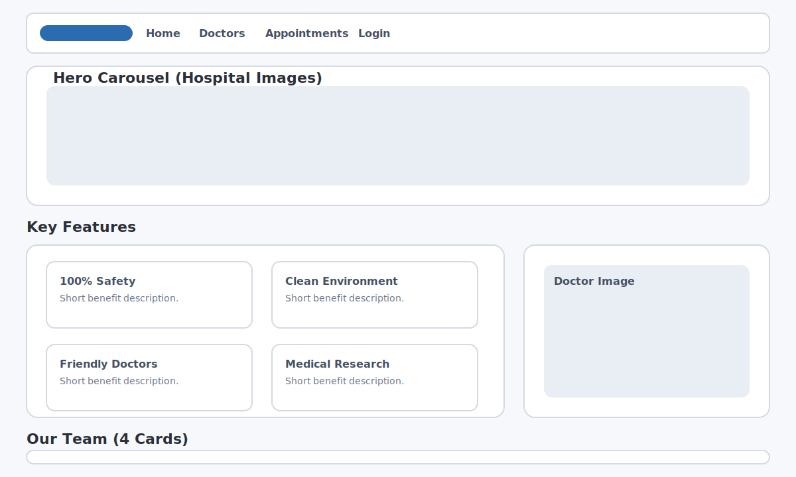

# Healthcare Management System (HMS)

A Java/JSP-based healthcare management system that supports patient appointments, doctor workflows, and admin management. The UI is built with JSP pages and Bootstrap styling, with a homepage carousel, feature cards, and team section.

## UI Structure Summary

- Public homepage layout and feature highlights: [src/main/webapp/index.jsp](src/main/webapp/index.jsp)
- User-facing pages: [src/main/webapp](src/main/webapp)
- Admin dashboard pages: [src/main/webapp/admin](src/main/webapp/admin)
- Doctor dashboard pages: [src/main/webapp/doctor](src/main/webapp/doctor)

## UI Preview (Illustrative)

> This mock layout mirrors the structure of the homepage (navbar, carousel, feature cards, team section).

## Key Features

- Appointment booking and tracking
- Doctor login and patient management
- Admin management of doctors and specialists
- Role-based access via separate login screens
