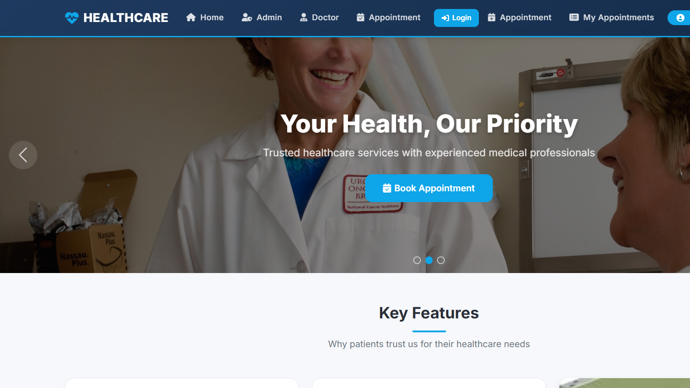
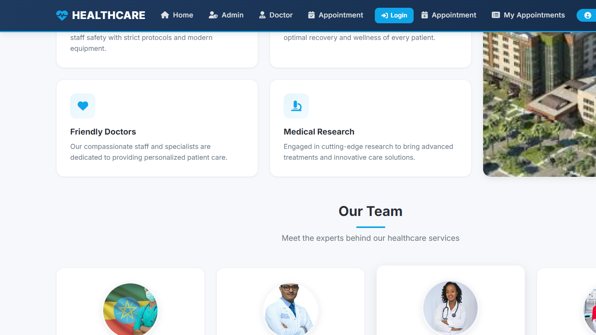
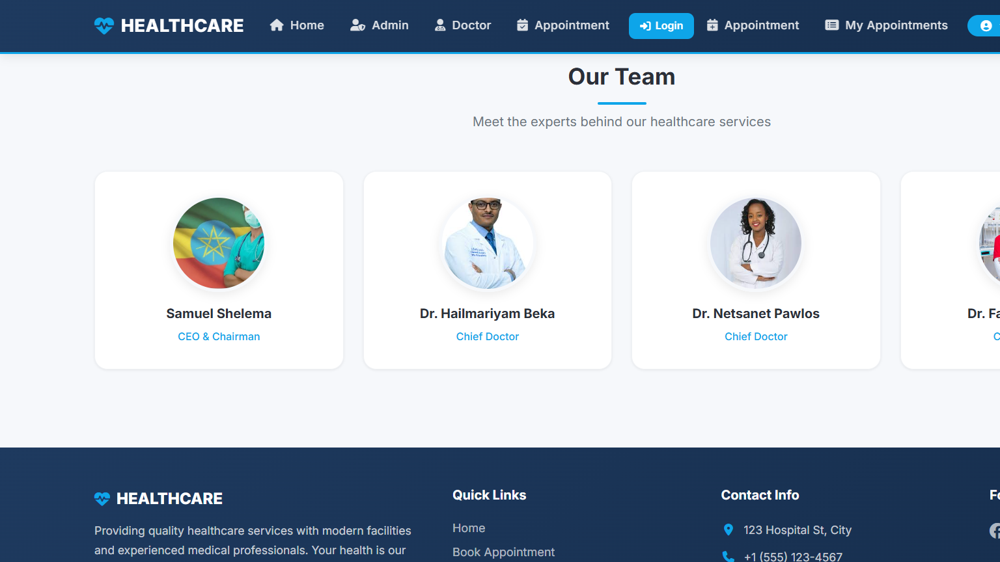
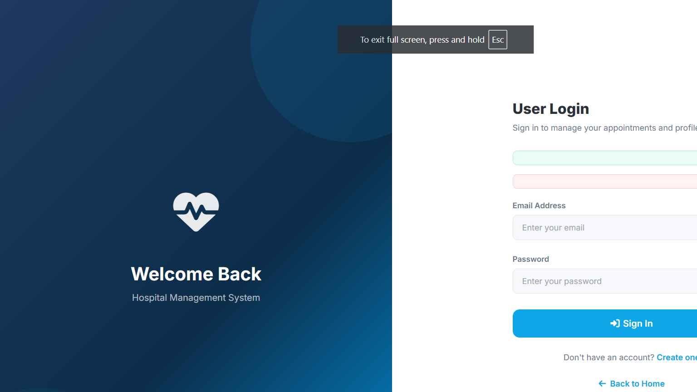
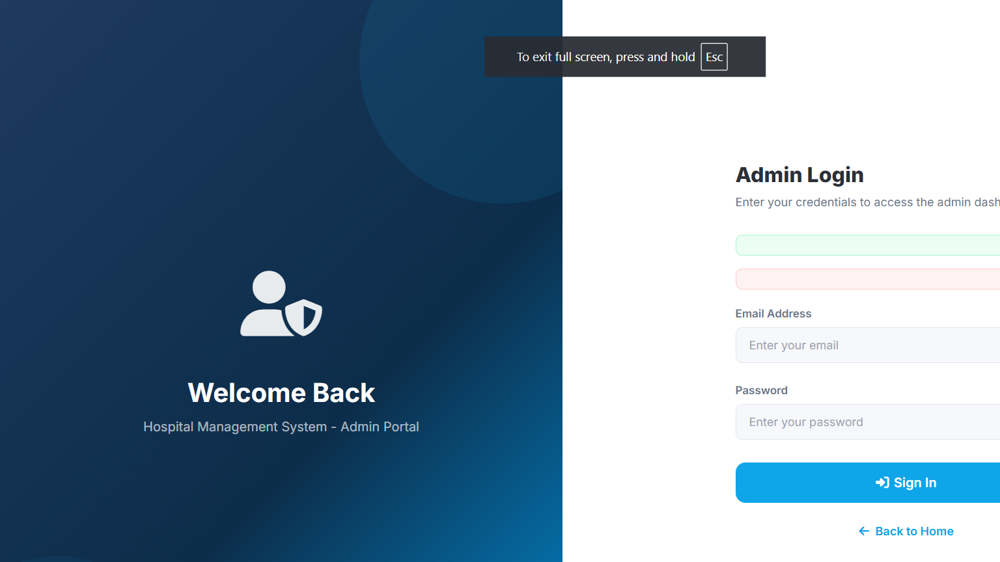
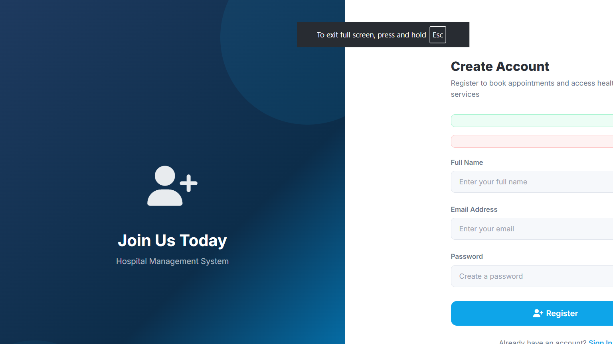

# Healthcare Management System (HMS)

A full-featured **Hospital Management System** built with Java EE, JSP, and Bootstrap 5. The system provides role-based dashboards for **Patients**, **Doctors**, and **Administrators** to manage appointments, profiles, and medical records.

---

## Screenshots

### Homepage — Hero Carousel
> Modern hero section with rotating hospital images, gradient overlay, and call-to-action button.



### Homepage — Key Features & Team
> Feature cards highlighting core services, and a team section showcasing medical professionals.





### User Login
> Clean split-screen layout with branded left panel and login form on the right.



### Admin Login
> Admin portal login with role-specific branding and secure password fields.



### User Registration
> Simple sign-up form for new patients to create an account.



---

## Key Features

- **Appointment Booking** — Patients can book appointments with available doctors by selecting a specialist, date, and time
- **Doctor Dashboard** — Doctors can view their patients, add comments, and manage their profile
- **Admin Dashboard** — Admins can add/edit/remove doctors, manage specialists, and view all patients
- **Role-Based Access** — Separate login portals for Patients, Doctors, and Admins
- **Modern UI** — Responsive design built with Bootstrap 5, Inter font, and a custom CSS design system

## Tech Stack

| Layer      | Technology                          |
|------------|-------------------------------------|
| Backend    | Java EE (Servlets, JSP)             |
| Frontend   | JSP, Bootstrap 5, Font Awesome 6    |
| Database   | MySQL / PostgreSQL (via JDBC)       |
| Build Tool | Apache Maven                        |
| Server     | Apache Tomcat 11                    |

## Project Structure

```
src/main/webapp/
├── index.jsp                  # Public homepage
├── user_login.jsp             # Patient login
├── admin_login.jsp            # Admin login
├── doctor_login.jsp           # Doctor login
├── signup.jsp                 # Patient registration
├── user_appointment.jsp       # Book appointment
├── view_appointment.jsp       # View appointments
├── change_password.jsp        # Change password
├── edit_profile.jsp           # Edit profile
├── css/
│   └── style.css              # Custom design system
├── img/                       # Images and assets
├── component/
│   ├── allcss.jsp             # Shared CSS/JS includes
│   ├── navbar.jsp             # Public navbar
│   └── footer.jsp             # Shared footer
├── admin/
│   ├── index.jsp              # Admin dashboard
│   ├── doctor.jsp             # Add doctor
│   ├── edit_doctor.jsp        # Edit doctor
│   ├── view_doctor.jsp        # View all doctors
│   ├── patient.jsp            # View all patients
│   └── navbar.jsp             # Admin navbar
└── doctor/
    ├── index.jsp              # Doctor dashboard
    ├── patient.jsp            # Doctor's patients
    ├── comment.jsp            # Add patient comment
    ├── edit_profile.jsp       # Doctor profile
    └── navbar.jsp             # Doctor navbar
```

## Getting Started

### Prerequisites

- **Java 17+** (JDK)
- **Apache Maven 3.8+**
- **MySQL** or **PostgreSQL** database

### Build & Run

```bash
# Clone the repository
git clone https://github.com/your-username/HMS-java.git
cd HMS-java

# Build the project
mvn clean package

# Run with embedded Tomcat (via Cargo plugin)
mvn cargo:run
```

The application will be available at: **http://localhost:8080/mavenHealthcare/**

---

## License

This project is for educational purposes.
